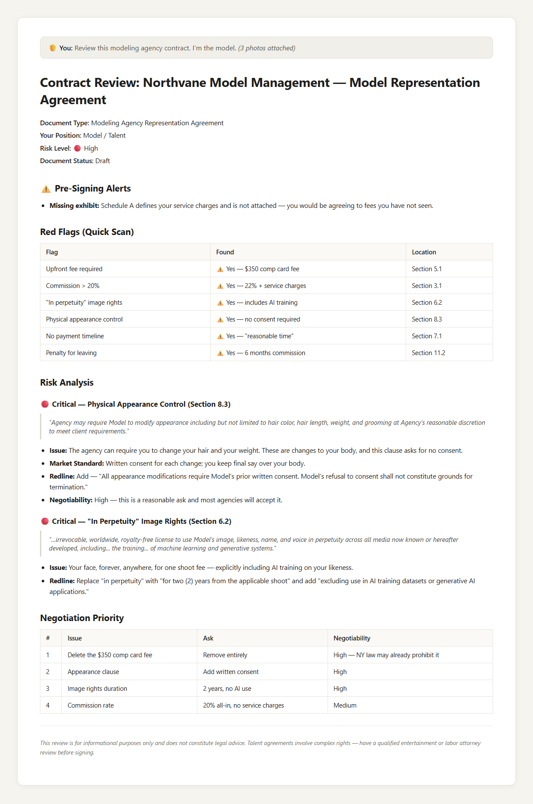

# Contract Review Skill — AI Protection for Models and Talent

> AI-powered contract review that reads agency agreements the way a lawyer would — catching the clauses that trap models, flagging agencies the community has reported, and telling you exactly what to push back on before you sign.

[](https://github.com/CptRizzen/modeling-contract-review/actions/workflows/ci.yml)
[](https://github.com/CptRizzen/modeling-contract-review/stargazers)
[](LICENSE)
[](https://agentskills.io)
[](https://github.com/TheAtticusProject/cuad)
[](CHANGELOG.md)
[](CONTRIBUTING.md)

**Works with:** Claude Code · OpenAI Codex · Cursor · GitHub Copilot · Gemini CLI · [26+ tools](https://agentskills.io)

> ⚖️ **This is not legal advice.** It is a first-pass reading tool that tells you what to ask and what to push back on. For anything with real money or multiple years on the line, have a lawyer look at it.

---

## Why this exists

A friend of mine is a model. She turns down work — not because the jobs are bad, but because too many people she knows got burned by something they signed. Five-year exclusivity. "In perpetuity" image rights. A commission that quietly became 40% after "service charges." An agency that wanted $600 up front for a portfolio.

None of that is exotic. It is standard predatory boilerplate, and it works because the person signing it has forty minutes in an agency office and no lawyer.

This puts a lawyer-shaped first read in her pocket, for free, in the time it takes to photograph the pages.

---

## What you get



Run it yourself on the fictional sample contract in [`examples/sample-contracts/predatory-agency-agreement.md`](examples/sample-contracts/predatory-agency-agreement.md) — full output in [`examples/modeling-agency-review.md`](examples/modeling-agency-review.md).

---

> **Forked from [evolsb/claude-legal-skill](https://github.com/evolsb/claude-legal-skill) by Chris Sheehan.**
> The original skill is an excellent general-purpose contract review tool. This fork adds full modeling and talent agency contract support, a community-sourced agency report database with auto-detection, and a plain-language guide written specifically for models. All original work remains Chris's. Additions are documented in [CHANGELOG.md](CHANGELOG.md).

---

## For Models: Start Here

You don't need to be a developer to use this. **Don't know what GitHub or a "skill" is?** No problem — [docs/for-models.md](docs/for-models.md) has a full plain-language setup guide for both Claude and ChatGPT. No tech skills required, free accounts work, and it covers how to photograph a paper contract on your phone. Start there.

### If you have a digital copy of the contract

1. Open [Claude.ai](https://claude.ai) or any AI assistant that has this skill installed
2. Say: **"Review this modeling agency contract. I'm the model."**
3. Paste the contract text
4. Read the output — problems are flagged 🔴 Critical / 🟡 Important / 🟢 Acceptable with specific language to negotiate

### If you're at the agency right now with a paper contract

You don't need a scanner. Claude can read text directly from photos.

1. Open [Claude.ai](https://claude.ai) on your phone
2. Photograph every page (flat surface, good lighting, full page in frame)
3. Upload all the photos and send this prompt:

> "Review this modeling agency contract. I'm the model. Check for: upfront fees, commission rate and hidden charges, image and likeness rights duration, physical appearance control clauses, exclusivity scope, payment timeline, exit terms and penalties, and whether any agency names appear on community report lists."

> **If an agency pressures you to sign on the spot and won't let you take the contract to review — that pressure is itself a red flag.** A legitimate agency will give you time.

**Not sure if an agency is legitimate?** Just ask: *"Is [agency name] a legitimate modeling agency?"* — the skill automatically checks a community-maintained report list (unverified allegations, not proof).

---

## Quick Install (Developers)

```bash
# Claude Code
git clone https://github.com/CptRizzen/modeling-contract-review ~/.claude/skills/modeling-contract-review

# OpenAI Codex
git clone https://github.com/CptRizzen/modeling-contract-review ~/.codex/skills/modeling-contract-review

# Other Agent Skills-compatible tools — clone to your tool's skills directory
```

---

## What This Fork Adds

Models get hurt by contracts they don't fully understand. Five-year exclusivity traps. Clauses that let agencies demand haircuts, weight changes, or color without consent. "In perpetuity" image rights that let a company use your face forever. Upfront fees that are just scams. These aren't edge cases — they're common, and they end careers and create real harm.

The original skill covers these areas in general terms. This fork goes further for models specifically:

- A 14-category checklist built for modeling and talent agency agreements
- Auto-detection of community-reported agencies before the contract review even starts
- Specific redline language for the clauses that most affect models
- Personal-safety prompts tied to community reports (framed as unverified allegations)
- A handout written for models, not developers

---

## What It Does

Analyzes legal contracts and outputs:
- **Community report check** — automatic 🚨 warning if the agency has been reported by the r/MODELING community, before any other analysis (unverified allegations — see the disclaimer below)
- **Risk assessment** with severity ratings (🔴 Critical / 🟡 Important / 🟢 Acceptable)
- **Red flags quick scan** — instant danger sign detection
- **Key terms table** with section references
- **Market standard benchmarks** — how terms compare to industry norms
- **Negotiability ratings** — what's realistic to change given power dynamics
- **Specific redlines** — actual replacement language, not just "negotiate this"
- **Missing provisions** with suggested language to add
- **Internal consistency checks** (broken cross-references, undefined terms)

### Generate Deliverables with legal-redline-tools

This skill outputs structured JSON redlines. To produce tracked-changes Word docs and redline PDFs, pair with [**legal-redline-tools**](https://github.com/evolsb/legal-redline-tools):

```bash
pip install git+https://github.com/evolsb/legal-redline-tools.git

legal-redline apply contract.docx redlined.docx \
    --from-json redlines.json \
    --pdf redline.pdf \
    --memo-pdf internal-memo.pdf
```

---

## Features

### Community Report Database
Automatically checks the counterparty agency name against a community-sourced list of modeling agencies reported on r/MODELING. If matched, a prominent warning appears at the top of the output before any analysis.

> ⚠️ **Every entry is an unverified allegation** posted by anonymous members of the public. None has been independently investigated or confirmed, and inclusion is **not** a statement that any business or person committed fraud, a crime, or any other wrongdoing. Treat the list as a prompt to research further, never as a verdict. Disputes and removal requests: [open an issue](https://github.com/CptRizzen/modeling-contract-review/issues) — see [SECURITY.md](SECURITY.md).

The list covers 30+ names, organized by the type of report:
- **Category 1** — reported to require upfront fees (24 entries)
- **Category 2** — reported to take payment and disappear
- **Category 3** — reported as evasive in communications
- **Category 4** — miscellaneous unverified concerns
- **Category 5** — 🚨 personal-safety reports about individuals (unverified allegations; the skill responds with safety precautions, not accusations)

Source: [r/MODELING "The Ultimate Scam Agency List"](https://www.reddit.com/r/MODELING/comments/1fif93l/the_ultimate_scam_agency_list_updated/) — community-maintained, updated periodically.

### Modeling / Talent Agency Support
Full 14-category checklist for models reviewing representation agreements:
- Contract duration (1-3 years standard; 5+ = red flag)
- Commission rate analysis (15-20% standard; stacked service charges flagged)
- Exclusivity scope — geographic and category limits
- Physical appearance control clauses (consent requirements)
- Image & likeness rights duration and "in perpetuity" detection
- Upfront fee detection (automatic red flag — any amount)
- Mother agency global commission tail analysis
- Expense deduction transparency and caps
- Payment timing (Net 30-60 from client payment = standard)
- Direct booking rights
- Portfolio and test shoot ownership
- Exit and termination rights
- Post-termination non-solicitation scope
- Coogan Law compliance check for minors

Jurisdiction notes: NY Labor Law Art. 11 (advance fees prohibited), CA AB 5, IL Talent Agency Act, Coogan Law (all US), international agency caveats.

### Position-Aware Review
Tell it which party you are (model, customer, vendor, buyer, seller, receiving party) — the skill adjusts what it flags as risky.

### Document Type Checklists
Specialized checklists for each contract type:
- **NDA** — confidentiality term, non-solicitation, standstill, destruction certification
- **SaaS/MSA** — SLA, data export, suspension rights, price caps
- **Payment/Merchant** — reserves, chargebacks, network rules, auto-debit
- **M&A** — earnouts, escrow, rep survival, sandbagging
- **Finder/Broker** — fee tails, covered buyer definitions, joint representation
- **Modeling/Talent Agency** — commission, exclusivity, image rights, appearance control, upfront fees, payment timing, exit rights, Coogan Law

### Market Standard Benchmarks
Compares terms to industry norms with clear thresholds:

| Provision | Standard | Yellow | Red |
|-----------|----------|--------|-----|
| Modeling contract duration | 1-2 years | 3 years | 5+ years |
| Agency commission | 15-20% | 20-25% | >25% |
| Upfront fees | $0 | Any amount | — |
| Image rights duration | Per-project or 1-2 yr | 3-5 years | "In perpetuity" |
| Liability cap (SaaS/MSA) | 12 months | 6-11 mo | <6 mo |
| Auto-renewal notice | 90+ days | 60-89 | <60 |
| Non-compete | 1-2 years | 3-4 years | 5+ |
| Rep survival (M&A) | 12-18 mo | 24-30 mo | 36+ mo |

### Negotiability Ratings
Tells you what's actually changeable:
- **High** — Mutual termination, cure periods, data export, appearance consent
- **Medium** — Liability cap increases, price caps, commission rate
- **Low** — Network rules, regulatory requirements

### Red Flags Quick Scan
Instant detection of danger signs including:
- Any upfront fee from a modeling agency
- Commission above 25%
- "In perpetuity" image/likeness rights
- Physical appearance control without consent
- Liability cap < 6 months
- Uncapped indemnification
- Unilateral amendment rights
- Offshore jurisdiction (BVI, Cayman)

### Jurisdiction Awareness
Flags when governing law affects enforceability:
- Non-competes void in CA/ND/OK/MN
- NY Labor Law Art. 11 prohibits advance fees from talent agencies
- Coogan Law (all US): minors require 15% of gross in blocked trust
- Delaware vs NY vs CA commercial implications
- Offshore jurisdiction cost/enforcement concerns

### M&A Support
Special handling for acquisition agreements:
- Earnout mechanics and measurement
- Rep & warranty survival periods
- Working capital adjustments
- Escrow/holdback provisions
- Employment comp in deal value calculations

---

## Usage Examples

```
Review this modeling agency contract - I'm the model

Does this talent agency contract let them change my appearance without my consent?

Is Nine9 a legitimate modeling agency?

Review this NDA for red flags - I'm the receiving party

Analyze the indemnification in this MSA - I'm the vendor

What are the termination provisions? I'm the customer.

Review this acquisition agreement - I'm the seller

Check this merchant agreement - what's my chargeback exposure?
```

---

## Installation (Developer / AI Tool Setup)

This skill follows the open [Agent Skills standard](https://agentskills.io) and works with any compatible tool.

```bash
# Claude Code
git clone https://github.com/CptRizzen/modeling-contract-review ~/.claude/skills/modeling-contract-review

# OpenAI Codex
git clone https://github.com/CptRizzen/modeling-contract-review ~/.codex/skills/modeling-contract-review

# Cursor, Copilot, Gemini CLI, etc.
# Clone to your tool's skills directory
```

### Development (Symlink)
```bash
git clone https://github.com/CptRizzen/modeling-contract-review ~/Developer/modeling-contract-review
ln -s ~/Developer/modeling-contract-review ~/.claude/skills/modeling-contract-review
```

---

## Limitations

- **Not legal advice** — always have material terms reviewed by qualified counsel
- **US law focus** — analysis defaults to US; provisions vary by jurisdiction
- **Context window** — very long contracts may need section-by-section review
- **Community list is unverified** — every entry is an unproven allegation from an anonymous public post, not a finding of fact, and may be wrong or out of date; always do independent research

## Accuracy

Based on ContractEval benchmarks, Claude achieves F1 ~0.62 on clause extraction. Best for first-pass review and issue flagging — not a replacement for attorney review on material deals.

---

## Resources

- **For models new to contract review:** [docs/for-models.md](docs/for-models.md) — plain-language guide, community report list, safety guidance
- **Full example outputs:** [NDA review](examples/nda-review.md) · [SaaS agreement](examples/saas-agreement-review.md) · [M&A deal](examples/ma-agreement-review.md) · [Modeling agency contract](examples/modeling-agency-review.md) · [Balanced agreement](examples/balanced-agreement.md)
- **Generate Word/PDF redlines:** [legal-redline-tools](https://github.com/evolsb/legal-redline-tools)

---

## Contributing

You do not need to be a developer. The most useful contributions here are contract knowledge and firsthand experience.

| I want to... | Go here |
|---|---|
| Report an agency or recruiter | [New community report](https://github.com/CptRizzen/modeling-contract-review/issues/new?template=agency-report.yml) |
| Correct or remove an entry about me | [Correction request](https://github.com/CptRizzen/modeling-contract-review/issues/new?template=list-correction.yml) · [SECURITY.md](SECURITY.md) |
| Tell us the review missed something | [Review-quality issue](https://github.com/CptRizzen/modeling-contract-review/issues/new?template=review-quality.yml) |
| Suggest a feature or contract type | [Feature request](https://github.com/CptRizzen/modeling-contract-review/issues/new?template=feature-request.yml) |
| Ask a question / share how it went | [Discussions](https://github.com/CptRizzen/modeling-contract-review/discussions) |

Read [CONTRIBUTING.md](CONTRIBUTING.md) first — the community report list has stricter rules than the rest of the project. All participation is covered by the [Code of Conduct](CODE_OF_CONDUCT.md).

**Never commit a real contract to this repo.** See [SECURITY.md](SECURITY.md) for what happens to your contract data and how to redact before pasting it into any AI tool.

---

## Credits

**Original skill:**
- [evolsb/claude-legal-skill](https://github.com/evolsb/claude-legal-skill) by Chris Sheehan — general-purpose contract review built on CUAD, ContractEval, and LegalBench
- [CUAD Dataset](https://github.com/TheAtticusProject/cuad) — Atticus Project (NeurIPS 2021)
- [LegalBench](https://hazyresearch.stanford.edu/legalbench/) — Stanford HAI
- [ContractEval](https://arxiv.org/abs/2303.07389) — Contract understanding benchmarks

**Modeling additions (this fork):**
- Community report list sourced from [r/MODELING community](https://www.reddit.com/r/MODELING/comments/1fif93l/the_ultimate_scam_agency_list_updated/)

---

## License

MIT — see [LICENSE](LICENSE)
